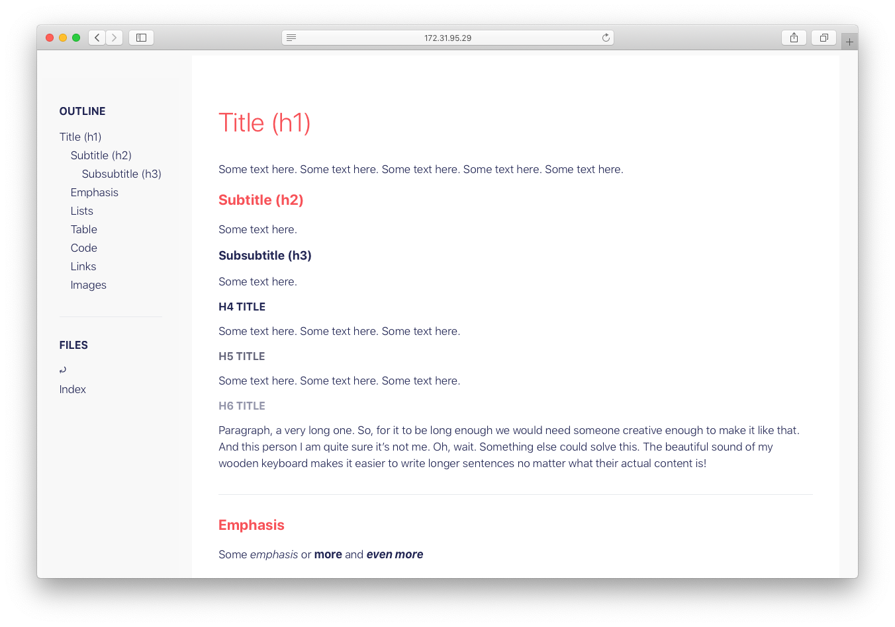

# caccuino

I use this to serve simple technical wikis that are purely based on markdown, the good old filesystem and no configuration

    npm install -g caccuino # or `npm link .` from this repo
    cd /folder/with/markdown/files # for example `example` dir in this repo
    caccuino

The spawned server will serve 

- searchable file listing for directories
- a rendered version of the markdown files
  - using `style.css` from the root directory
  - with codeblock syntax hilight
  - with rendering of mermaidjs diagrams
  - including a responsive sidebar with
    - an outline of the current document
    - a list of adjacent files
- serve any other static file as is (images, artifacts..)

#### Under development

- [x] render an outline of the current document
- [x] render a filetree of adiacent documents
- [ ] better printable css media
- [ ] hotreload changes (?)
